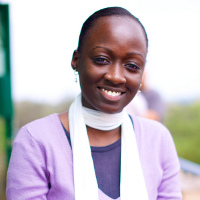
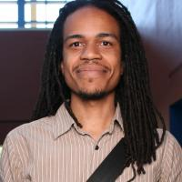
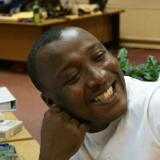

## Mobile Technology Workshop

The goal of the workshop is to give participants an introduction to mobile tech
applications that enable new approaches to issues such as urban and community
planning, economics and markets, political participation, and personal and
environmental health. We wanted participants to leave with ideas of what's
possible and what some of the successes and pitfalls people have experienced are.

The workshop featured presenters from several projects and organizations
that are working on mobile empowerment tools.

### Schedule:

The workshop took place on Tuesday, 20 November 2012 at 2:00 PM at the St.
George conference center outside of Pretoria, South Africa.

  Time  | Event
:------:|:-------
  2:00  | Welcome & Introduction
  2:15  | [Brief Presentations](#Presenters)
  3:15  | Break
  3:30  | Mobile Design Exercise
  4:30  | Wrap up
  
### Presenters

Our four presenters took about 20 minutes each to explain their
work, how they use mobile technology to empower people, and how the 
environment into which the projects were deployed contributed to their
effectiveness.

-

*Jabu Mtsweni* is a Senior Lecturer and Researcher @ UNISA in the field of
Computer Science and Information Systems. He holds a Master's Degree in Computer
Systems from Tshwane University of Technology (South Africa).
Currently,completing his PhD studies in Computer Science with the University of
South Africa. His PhD focuses on the engineering of intelligent semantic
services.

-

*Angela Oduor* is a software developer with Ushahidi, non-profit tech company, born
in Africa, which specializes in developing free and open source software for
information collection, interactive mapping and data curation. She is a recent
First Class honors graduate from Strathmore University with a degree in Business
Information Technology. Her work at Ushahidi involves developing web
applications on the Ushahidi platform, and providing technical support to users
of Ushahidi's cloud based system, Crowdmap.

-

*Mjumbe Poe* is a software developer working from Philadelphia with OpenPlans, a
NY-based organization dedicated to making cities better. He was a 2011 Code for
America fellow on the Philadelphia and Seattle city teams. He has a passion for
projects that allow people to better use and affect their environments. Recent
projects include Councilmatic and Shareabouts.

-

*E. Osei-Poku* is the Product Manager at Esoko where he leads a young group
of product designers. They innovate, develop and build technology solutions (web
& mobile) which address specific market challenges in Africa. Esoko is providing
agric-based mobile solutions in 16 African countries. He is a double Master's
Degree holder in Information Technology and Management Information Systems from
the University of Salford, UK. Osei recently moved back to Ghana with his wife
and two young children.

